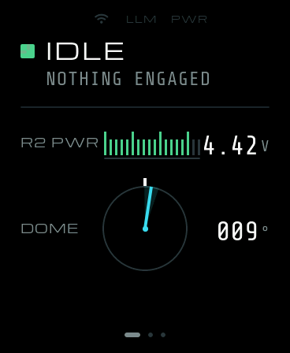
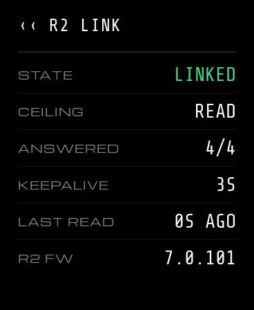

# r2-z2 — a persistent AI mind for the Sphero R2-D2

**Give a Sphero R2-D2 a brain that stays.** An ESP32-S3 backpack replaces the
discontinued Sphero app: it holds the BLE link, runs his idle life locally,
listens through its own microphone, and calls a language model only when there
is something worth thinking about. Mood, energy, boredom and memory live on the
board and survive a reboot, a Wi-Fi outage, and a change of AI vendor.

> The experiment succeeds when R2-D2 stops feeling like hardware receiving
> commands and starts feeling like the same little entity is continuously there.

<p align="center">
  
  &nbsp;&nbsp;
  
</p>
<p align="center"><sub>The backpack's 1.8" AMOLED is a service panel, not a face. Captured off the real glass by the firmware's own screenshot path.</sub></p>

## Why this exists

Sphero stopped supporting the app-enabled R2-D2. The droid is still excellent:
a motorised dome, a bipod/tripod stance, authored animations, 212 of his own
sounds, front and rear RGB, logic and holo lights. What died was the software.

Most "AI robot" projects put an LLM in the loop for everything. That makes a
robot that is laggy, expensive, and dead when the internet is. This one takes
the opposite bet:

- **The character is persistent state plus local behaviour.** The LLM is a
  reasoning service that state consults. Swap vendors and R2 is still R2.
- **Routine life never touches the cloud.** Idle, sleep and wake, mood drift,
  boredom, quiet hours, simple reactions: all on the ESP32, no network.
- **The reasoning layer speaks in intent, not motors.** It calls
  `express_curious()`, never `set_head_position(-27)`. Each semantic behaviour
  choreographs dome, sound, lights and stance over time.
- **His body is the whole interface.** No face on a screen, no chat window.
  The backpack screen is for status, diagnostics and provisioning, read up
  close. The LEDs are the glanceable signal across the room.

## What works today

On the board (ESP32-S3, C, ESP-IDF, LVGL 9):

- BLE central link to R2 with keepalive, coexisting with Wi-Fi, measured.
- Hold the state word on the screen to **wake** him or say **goodnight**. He
  connects in about three seconds, and releasing the link lets him sleep on
  his own.
- One interaction state machine drives both the screen and his lights:
  `asleep → waking → idle → listening → thinking → answering → idle`.
- **Hold to talk**: the on-board ES8311 microphone captures while you hold the
  lower half of the face.
- A **reply**: chirp, lights, and a dome turn composed into one gesture, each
  actuator behind a consent ladder the operator opens rung by rung.
- A hardware STOP that outranks every gate.

On the Mac (Python, the prototyping host):

- A clean-room **Sphero V2 packet layer**, cross-validated against three
  independent implementations.
- A full voice loop: custom wake word → local Whisper → LLM `react` tool call →
  semantic behaviour → R2 over BLE.
- A behaviour, mood and light-language engine with 670+ tests, and a survey
  harness for measurements where a human is the instrument.

Not yet wired on the board: speech-to-text and the LLM call themselves, the
wake word, and memory across reboots. Those are the next slices, in that order.

## The research is the other half of the repo

Every finding is traced to source with `file:line` and labelled
`OBSERVED` / `INFERRED` / `UNKNOWN`. If you own one of these droids, this is
probably what you came for:

| Doc | What it holds |
|---|---|
| [r2-protocol.md](docs/research/r2-protocol.md) | The R2-D2 BLE and Sphero V2 protocol, traced from source: handshake, framing, DID/CID tables, timing floor |
| [r2-capabilities.md](docs/research/r2-capabilities.md) | Everything he can do and what it actually looks like on hardware: sounds by family, animations, LED masks, dome and stance limits |
| [board-capabilities.md](docs/research/board-capabilities.md) | The Waveshare ESP32-S3-Touch-AMOLED-1.8: rails, buses, PSRAM, the sdkconfig that does not hang it |
| [decisions.md](docs/decisions.md) | 32 architecture decisions, each with the evidence and the alternatives it beat |
| [port-boundary.md](docs/port-boundary.md) | What survived the move from Python to C, and what only looked like architecture |

Hardware truths that cost real time and are written down so you can skip them:
the dome has no home position and silently ignores moves under ~10.5°; an
authored "nod" animation can put him on the floor; an LED colour you set
survives the link dropping but not a sleep cycle; and our keepalive *is* his
wake command, so he never sleeps while a controller is connected.

## Hardware

- **Sphero R2-D2** app-enabled droid (BLE name `D2-XXXX`).
- **Waveshare ESP32-S3-Touch-AMOLED-1.8** as the backpack: 1.8" AMOLED,
  capacitive touch, ES8311 codec and mic, AXP2101 PMIC, IMU, microSD. The
  board revision is verified at runtime, never trusted from the listing.
- A Mac for prototyping and flashing. **No Raspberry Pi.**

## Layout

```
docs/                   intent, architecture, decision log, source-traced research
firmware/panel/         the backpack firmware (ESP-IDF 5.5, NimBLE central, LVGL 9)
firmware/*_check/       one-purpose diagnostics run before anything riskier
mac-prototype/          Python: packet layer, BLE daemon, behaviour engine, voice loop
mac-prototype/voice/    wake word, capture, Whisper, LLM reasoning, speech
CLAUDE.md               engineering rules, and the hardware lessons behind them
```

## Quick start

**Talk to the droid from a Mac** (needs a one-time Bluetooth grant, see
[mac-prototype/README.md](mac-prototype/README.md)):

```bash
cd mac-prototype && ./r2 scan
```

```bash
./r2 daemon --allow read      # read-only: battery, dome angle, firmware
```

Every rung above `read` is opt-in at launch and refused otherwise:
`leds → audio → dome → stance → locomotion`. The class of physical behaviour
he can produce is set by you, not by whatever sends a command.

**Build the backpack firmware** (ESP-IDF v5.5.x):

```bash
cd firmware/panel && tools/build_both.sh && idf.py -p <port> flash
```

Read [firmware/README.md](firmware/README.md) first: it explains why the first
thing to flash is a read-only board check and why the link is proved by reading
battery voltage, not by moving the dome.

## Safety

R2 is physical hardware with a motor that can tip him over. Bring-up order is
fixed and each actuator is individually opt-in: **read-only → LEDs → audio →
dome → stance → locomotion.** Disconnect or failure means stop, never
last-command. Never flash firmware built for another board revision. Never
commit credentials; Wi-Fi and API keys go into NVS from a local `.env`.

## Contributing

Issues and PRs are welcome, especially hardware observations from other
R2-D2 units and other board revisions. Read [CLAUDE.md](CLAUDE.md) before
touching code: it is the engineering contract for the repo, and most of it is
measurements that were expensive to make. `main` is protected; everything
lands by pull request.

## License

[MIT](LICENSE). Sphero, R2-D2 and Star Wars are trademarks of their respective
owners; this is an independent hobby project with no affiliation.
